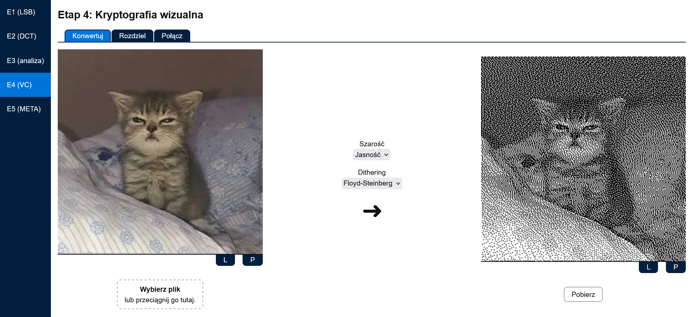
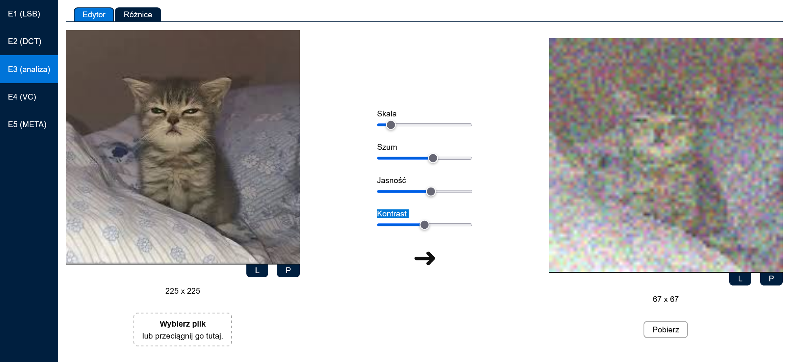

# [Image Steganography](https://pwr-acs-se-24.github.io/EoSaKAfDaD) (Engineering of Security and Knowledge Acquisition from Data and Databases)

The following project is a web-based tool for experimenting with various image steganography techniques, enabling users to hide data in digital images and extract it from them. Implemented mainly using TypeScript, Angular, and Rust (WebAssembly), it supports methods like Least Significant Bit (LSB), Discrete Cosine Transform (DCT), wavelet transform, visual cryptography, and metadata manipulation for PNG and JPEG formats. The tool also includes features for image editing and comparison, helping evaluate the robustness of each method.

<table align="center">
  <thead>
    <tr>
      <th colspan="6">Team G2</th>
    </tr>
  </thead>
  <tbody>
    <tr>
      <td rowspan="2">

      </td>
      <td>**Przemysław Barcicki**</td>
      <td rowspan="2">

      </td>
      <td>**Tomasz Chojnacki**</td>
      <td rowspan="2">

      </td>
      <td>**Jakub Zehner**</td>
    </tr>
    <tr>
      <td>[@mlodybercik](https://github.com/mlodybercik)</td>
      <td>[@tchojnacki](https://github.com/tchojnacki)</td>
      <td>[@jakubzehner](https://github.com/jakubzehner)</td>
    </tr>
  </tbody>
</table>

## Algorithms 🧠

<table align="center">
  <thead>
    <tr>
      <th>Stage</th>
      <th>Algorithm</th>
      <th>Language</th>
    </tr>
  </thead>
  <tbody>
    <tr>
      <th rowspan="2">E1 (LSB)</th>
      <td>Least significant bit steganography v1 (7-bit, ASCII-only)</td>
      <td rowspan="2">Rust</td>
    </tr>
    <tr>
      <td>Least significant bit steganography v2 (8-bit, any data)</td>
    </tr>
    <tr>
      <th>E2 (DCT)</th>
      <td>Discrete cosine transform steganography</td>
      <td>TypeScript</td>
    </tr>
    <tr>
      <th rowspan="2">E3 (analysis)</th>
      <td>Image editor (scale, noise, brightness, contrast)</td>
      <td rowspan="2">Rust</td>
    </tr>
    <tr>
      <td>Image comparison/diffing (brightness, contrast)</td>
    </tr>
    <tr>
      <th rowspan="3">E4 (VC)</th>
      <td>Grayscale converter (Floyd-Steinberg, random, and threshold dithering)</td>
      <td rowspan="3">Rust</td>
    </tr>
    <tr>
      <td>Visual cryptography: split image</td>
    </tr>
    <tr>
      <td>Visual cryptography: merge images</td>
    </tr>
    <tr>
      <th rowspan="2">E5 (meta)</th>
      <td>Metadata steganography: PNG</td>
      <td rowspan="2">TypeScript</td>
    </tr>
    <tr>
      <td>Metadata steganography: JPEG</td>
    </tr>
    <tr>
      <th>—</th>
      <td>Wavelet transform steganography</td>
      <td>Python</td>
  </tbody>
</table>

## Repository 🗃️

- `/code` - implementation of the website and algorithms
  - `/projects` - projects within the workspace
    - `/app` - an Angular web app and algorithms implemented in TypeScript
    - `/steg` - a WebAssembly module with algorithms implemented in Rust
- `/docs` - documentation for the academic course
